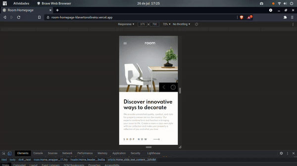

# Room Homepage (English / Português)
[](https://github.com/KlevertonOliveira/room-homepage/blob/master/LICENSE)

---

## :art: Layout web



---

[Project Presentation](https://room-homepage-klevertonoliveira.vercel.app/) /
[Apresentação do Projeto](https://room-homepage-klevertonoliveira.vercel.app/)

---

## :mag_right: About the project / Sobre o projeto

Room Homepage is an application developed as a solution to the [challenge](https://www.frontendmentor.io/challenges/room-homepage-BtdBY_ENq) of the same name proposed by [Frontend Mentor](https://www.frontendmentor.io/) website. As a differential for the development of this application, I chose to use NextJS (Framework based on React JS) together with SASS (CSS3 extension) in order to make the development process more practical, agile and responsive.

The application implements a design of a homepage for a company involved in the field of furniture decoration. As it is fully responsive, the application is suitable for viewing by devices with different screen sizes, implementing the interfaces established by the challenge respecting the intervals provided (from 375px and 1220px).

---

Room Homepage é uma aplicação desenvolvida como solução ao [desafio](https://www.frontendmentor.io/challenges/room-homepage-BtdBY_ENq) de mesmo nome proposto pelo site [Frontend Mentor](https://www.frontendmentor.io/). Como diferencial para o desenvolvimento deste aplicativo, optei por utilizar NextJS (Framework baseado em React JS) juntamente com SASS (extensão do CSS3) com o objetivo de tornar o processo de desenvolvimento mais prático, ágil e responsivo.

A aplicação implementa um projeto de uma homepage para uma empresa envolvida com o ramo de decoração mobiliária.  Por ser totalmente responsiva, a aplicação atende à visualização por aparelhos com tamanhos de tela variados, implementando as interfaces estabelecidas pelo desafio respeitando os intervalos fornecidos (a partir de 375px e 1220px).

---

## :gear: Technologies Used / Tecnologias utilizadas

### Front end
- HTML5
- [SASS](https://sass-lang.com/) (CSS extension)
- Javascript ES6
- [NextJS](https://nextjs.org/) (React Framework)

## :file_folder: How to run the project / Como executar o projeto

Prerequisites / Pré-requisitos: npm / yarn

```bash
# Clone repository / Clonar repositório
git clone https://github.com/KlevertonOliveira/room-homepage.git

# Enter the project folder / Entrar na pasta do projeto
cd room-homepage

# Install dependencies / Instalar dependências
yarn install

# Run the project / Executar o projeto
yarn dev or/ou yarn build && yarn start
```

## :raising_hand_man: Author / Autor

José Kleverton Yvens Oliveira

https://www.linkedin.com/in/kleverton-oliveira/